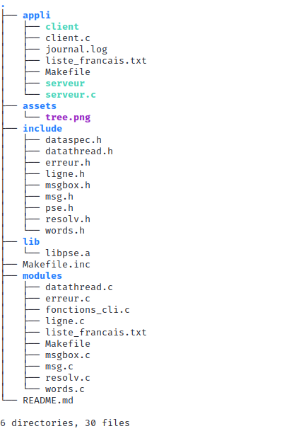

# ProjetPSE
Multiplayer Typing Game in C

## Fonctionnement

Comment utiliser notre programme:

1. Il faut compiler les modules dans le dossier `modules`:

        cd modules
        make

2. Il faut compiler le serveur et le client dans le dossier `appli` :

        cd ../appli
        make

3. Il faut lancer le serveur, dossier `appli`:

        ./server <port>

4. Il faut lancer le/les client, dosser `appli` :

        ./client <ip> <port>

## Principe du jeu

- Jeu multijoueur : on peut connecter plusieurs clients au serveur (jusqu'à 10) modifiable dans le fichier `server.c` ligne 6.
- Le serveur attend que tous les clients soient prêts pour lancer la partie (appui sur la touche "o" puis "enter")
- Lorsque tous les clients sont prêts, le serveur envoie un mot français aléatoire à tous les clients, le but est de taper ce mot le plus vite possible.
A chaque fois qu'un client tape un mot, le serveur lui envoie un nouveau mot et incrémente son score de 1 point.
- Une partie dure 30 secondes (modifiable dans le fichier `server.c` ligne 5)
- A la fin de la partie, le serveur affiche le classement des joueurs et leur score.

## Architecture du projet

Voici l'arbre du projet :

- Le dossier **appli** contient les codes sources (.c) du serveur et des clients.
- Le dossier **assets** contient les images utilisées pour le README.md.
- Le dossier **include** contient les fichiers d'en-tête (.h) utilisés par le serveur et les clients et le fichier pse.h qui nous permet d'inclure toutes les librairies en une seule fois.
- Le dossier **lib** contient les executables des modules (.a) utilisées par le serveur et les clients.
- Le dossier **module** contient les codes sources (.c) utilisés par le serveur et les clients.

